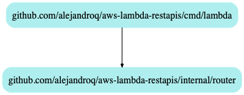

# transactionsapi

## Purpose

Facilitate CRUD user transactions.

## Getting Started

`make start` to run the API locally.

`less Makefile` for additional commands.

`invoke.http` requires the VSCode plugin - [REST Client](https://marketplace.visualstudio.com/items?itemName=humao.rest-client).

